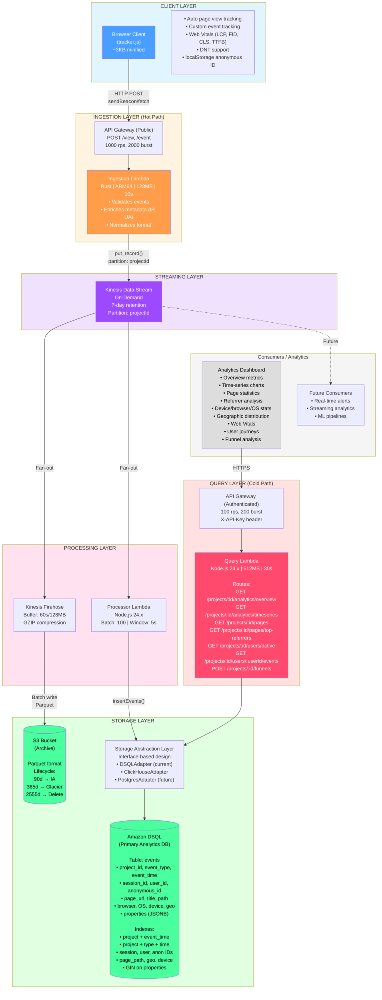

```mermaid
graph TB
    subgraph Client["CLIENT LAYER"]
        Browser["Browser Client<br/>(tracker.js)<br/>~3KB minified"]
        Browser_Features["• Auto page view tracking<br/>• Custom event tracking<br/>• Web Vitals (LCP, FID, CLS, TTFB)<br/>• DNT support<br/>• localStorage anonymous ID"]
    end

    subgraph Ingestion["INGESTION LAYER (Hot Path)"]
        APIGW["API Gateway (Public)<br/>POST /view, /event<br/>1000 rps, 2000 burst"]
        IngestLambda["Ingestion Lambda<br/>Rust | ARM64 | 128MB | 10s<br/>• Validates events<br/>• Enriches metadata (IP, UA)<br/>• Normalizes format"]
    end

    subgraph Streaming["STREAMING LAYER"]
        Kinesis["Kinesis Data Stream<br/>On-Demand<br/>7-day retention<br/>Partition: projectId"]
    end

    subgraph Processing["PROCESSING LAYER"]
        Processor["Processor Lambda<br/>Node.js 24.x<br/>Batch: 100 | Window: 5s"]
        Firehose["Kinesis Firehose<br/>Buffer: 60s/128MB<br/>GZIP compression"]
    end

    subgraph Storage["STORAGE LAYER"]
        DSQL[("Amazon DSQL<br/>(Primary Analytics DB)<br/><br/>Table: events<br/>• project_id, event_type, event_time<br/>• session_id, user_id, anonymous_id<br/>• page_url, title, path<br/>• browser, OS, device, geo<br/>• properties (JSONB)<br/><br/>Indexes:<br/>• project + event_time<br/>• project + type + time<br/>• session, user, anon IDs<br/>• page_path, geo, device<br/>• GIN on properties")]
        S3[("S3 Bucket<br/>(Archive)<br/><br/>Parquet format<br/>Lifecycle:<br/>90d → IA<br/>365d → Glacier<br/>2555d → Delete")]
        StorageAbstraction["Storage Abstraction Layer<br/>Interface-based design<br/>• DSQLAdapter (current)<br/>• ClickHouseAdapter<br/>• PostgresAdapter (future)"]
    end

    subgraph Query["QUERY LAYER (Cold Path)"]
        QueryGW["API Gateway (Authenticated)<br/>100 rps, 200 burst<br/>X-API-Key header"]
        QueryLambda["Query Lambda<br/>Node.js 24.x | 512MB | 30s<br/><br/>Routes:<br/>GET /projects/:id/analytics/overview<br/>GET /projects/:id/analytics/timeseries<br/>GET /projects/:id/pages<br/>GET /projects/:id/pages/top-referrers<br/>GET /projects/:id/users/active<br/>GET /projects/:id/users/:userId/events<br/>POST /projects/:id/funnels"]
    end

    subgraph Consumers["Consumers / Analytics"]
        Dashboard["Analytics Dashboard<br/>• Overview metrics<br/>• Time-series charts<br/>• Page statistics<br/>• Referrer analysis<br/>• Device/browser/OS stats<br/>• Geographic distribution<br/>• Web Vitals<br/>• User journeys<br/>• Funnel analysis"]
        Future["Future Consumers<br/>• Real-time alerts<br/>• Streaming analytics<br/>• ML pipelines"]
    end

    Browser -->|"HTTP POST<br/>sendBeacon/fetch"| APIGW
    APIGW --> IngestLambda
    IngestLambda -->|"put_record()<br/>partition: projectId"| Kinesis
    Kinesis -->|"Fan-out"| Processor
    Kinesis -->|"Fan-out"| Firehose
    Kinesis -.->|"Future"| Future

    Processor -->|"insertEvents()"| StorageAbstraction
    StorageAbstraction --> DSQL
    Firehose -->|"Batch write<br/>Parquet"| S3

    Dashboard -->|"HTTPS"| QueryGW
    QueryGW --> QueryLambda
    QueryLambda --> StorageAbstraction

    style Client fill:#e1f5ff
    style Ingestion fill:#fff4e1
    style Streaming fill:#f0e1ff
    style Processing fill:#ffe1f0
    style Storage fill:#e1ffe1
    style Query fill:#ffe1e1
    style Consumers fill:#f5f5f5

    style Browser fill:#4a9eff,color:#fff
    style IngestLambda fill:#ff9d4a,color:#fff
    style Kinesis fill:#9d4aff,color:#fff
    style DSQL fill:#4aff9d,color:#000
    style S3 fill:#4aff9d,color:#000
    style QueryLambda fill:#ff4a6e,color:#fff
    style Dashboard fill:#ddd,color:#000

```